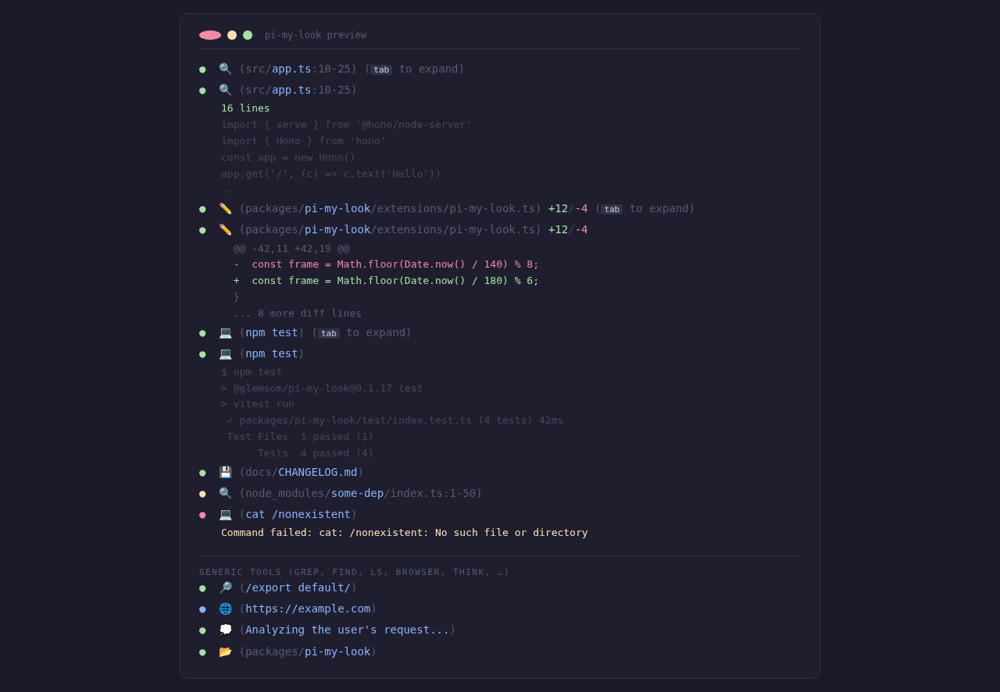

# pi-my-look

Version 0.2.2

Modern UI polish for the [pi coding agent](https://github.com/earendil-works/pi-coding-agent).



## Features

- **Pulsating Status Dot:** A single `●` that pulses through theme colors (muted → accent → warning → accent → muted → dim) while in-progress. On completion: `✓` (green) for success, `✗` (red) for error — accessible symbols that are unambiguous even without color vision.
- **Tool Icons:** Every tool gets a deterministic emoji icon and theme color via the `TOOL_UI_CONFIG` lookup map, with `DEFAULT_TOOL_CONFIG` fallback (⚡, accent) for unknown tools. The map covers 42+ `ctx_*` tools, all built-in tools, and `lean-ctx` command entries.

  | Icon | Tools | Rendering |
  |------|-------|-----------|
  | 🔍 | `read` | Specialised — path + offset:limit range display |
  | ✏️ | `edit` | Specialised — inline diff stats (+N/-M) + coloured diff preview |
  | ❯ | `bash` | Specialised — exit code + stderr differentiation |
  | 💾 | `write` | Generic — dot + icon + path |
  | 🔎 | `grep`, `find`, `ctx_grep`, `ctx_find`, `ctx_search`, `ctx_semantic_search`, `search` | Generic |
  | 📂 | `ls`, `ctx_ls` | Generic |
  | 📖 | `ctx_read`, `ctx_git_read` | Generic |
  | ⚡ | All other `ctx_*` tools, MCP tools, custom extensions | Generic (fallback) |
  | 🌐 | `browser` | Generic |
  | 💭 | `think` | Generic |
  | 🔔 | `notify` | Generic |
  | ❓ | `ask` | Generic |
  | 📋 | `context`, `ctx_outline`, `ctx_summary` | Generic |
  | 🧠 | `ctx_knowledge` | Generic |
  | 🌳 | `ctx_tree` | Generic |
  | 🔗 | `ctx_graph` | Generic |
  | 📦 | `ctx_compress`, `ctx_pack`, `ctx_transcript_compact` | Generic |
  | 🔌 | `ctx_provider`, `ctx_plugins` | Generic |
  | 🗺️ | `ctx_overview` | Generic |
  | 💾 | `ctx_session` | Generic |
  | 📤 | `ctx_expand`, `ctx_share` | Generic |
  | 💥 | `ctx_impact` | Generic |
  | 📞 | `ctx_callgraph`, `ctx_call` | Generic |
  | ⏱️ | `ctx_benchmark` | Generic |
  | 🔬 | `ctx_analyze` | Generic |
  | 🤖 | `ctx_agent` | Generic |
  | 🧩 | `ctx_compose` | Generic |
  | 🎯 | `ctx_intent` | Generic |
  | 📚 | `ctx_multi_read` | Generic |
  | 📝 | `ctx_plan` | Generic |
  | 📡 | `ctx_radar` | Generic |
  | 🔧 | `ctx_refactor` | Generic |
  | 👁️ | `ctx_review` | Generic |
  | 🛠️ | `ctx_tools` | Generic |
  | ✅ | `ctx_verify` | Generic |

  > **Specialised** = custom `pi.registerTool()` with unique rendering logic (path ranges, diff stats, exit codes). \
  > **Generic** = monkey-patched rendering: pulse dot + emoji icon + formatted args + keyboard hint + result summary.

- **Semantic Path Highlighting:** File paths are rendered with dimmed directories and accented filenames to reduce visual noise.
- **Smart Formatting:** Multi-line bash commands are automatically indented (using dynamic indent width that adapts to the prefix) for readability.
- **Smart Path Truncation:** Long file paths are middle-truncated (preserving the filename) to fit within a consistent width, avoiding line wrapping.
- **Inline Diff Stats:** The `edit` tool displays addition/removal counts (e.g., `+5 / -2`) directly on the collapsed call line, computed once in `execute` to avoid render loops.
- **Collapsible Execution Results:** Output is hidden by default when collapsed, showing a keyboard hint to expand. When expanded, it previews content (e.g., file lines, bash output, or full colored diffs for edits).
- **Bash Exit Codes & Stderr:** Completed bash commands display `exit 0` (muted) or `exit N` (error red) on the collapsed call line. When expanded, stderr output from failed commands renders in error color.
- **Automatic Coverage:** Rendering is applied generically to ALL tools — `ctx_*` tools, MCP tools, and any custom extension tools — without per-tool configuration.

## How it works

pi-my-look uses **monkey-patching** on `ToolExecutionComponent.prototype` to intercept the TUI's call and result rendering pipeline, keeping tool execution completely untouched.

### Architecture

```
ToolExecutionComponent.prototype
├── getCallRenderer()   ← patched (#13)
│   ├── read / edit / bash  → delegate to original (uses pi.registerTool custom renderers)
│   └── everything else     → genericCallRenderer(toolName)
│       ├── getStatusIndicator()     → ● pulse / ✓ success / ✗ error
│       ├── getToolConfig()          → icon + color from TOOL_UI_CONFIG
│       ├── formatArguments()        → path highlighting, truncation
│       └── keyHint()                → keyboard shortcut hint
└── getResultRenderer() ← patched (#14)
    ├── read / edit / bash  → delegate to original
    └── everything else     → genericResultRenderer(toolName)
        ├── isPartial?       → "toolName..." (warning)
        ├── summarizeResult() → diff stats (+N/-M), error preview, line count
        ├── !expanded?       → empty (summary shown on call line)
        └── expanded         → up to 15-line content preview with truncation
```

### Tool UI Configuration

`TOOL_UI_CONFIG` is an open lookup map — add any tool name with an icon/color pair and it automatically gets styled. Tools not in the map inherit `DEFAULT_TOOL_CONFIG` (⚡, accent). The map currently covers 42+ `ctx_*` tools and all built-in tools.

### Separation of concerns

- **Tool execution** — completely unchanged. Built-in tool `execute()` functions run as-is through `pi.registerTool()` (for read/edit/bash) or directly through built-in tool definitions.
- **Tool rendering** — intercepted at the `ToolExecutionComponent` level. The monkey-patches decide which renderer to use based on the tool name, keeping specialised renderers for read/edit/bash and applying generic rendering to everything else.

## Prerequisites

- **pi** >= 0.79.0 — earlier versions may not export all types used by this extension (`ToolRenderContext`, tool details interfaces like `ReadToolDetails`, `BashToolDetails`, `EditToolDetails`).
- **@earendil-works/pi-tui** — required peer dependency. The extension uses `Text`, `keyHint`, and theme functions exported by pi-tui.
- **Modern terminal** with Unicode/emoji support — see [Compatibility](#compatibility) below.

## Compatibility

This extension uses emoji icons and a single `●` dot for tool rendering. These characters require:

- A **modern terminal emulator** with good Unicode support (e.g., kitty, iTerm2, Windows Terminal, GNOME Terminal, Alacritty).
- An **emoji-aware font** or a **Nerd Font** that includes the required glyphs. If emoji appear as blank squares or boxes, try installing a Nerd Font ([nerdfonts.com](https://www.nerdfonts.com/)) and configuring your terminal to use it.

The extension degrades gracefully if the terminal lacks full Unicode support — tool names and file paths remain readable, but icons may not render as intended.

## Install

```bash
pi install npm:@glemsom/pi-my-look
```

## Customize

There are two ways to add or change tool icons and colors. The monkey-patch architecture means no per-tool registration is needed — just provide an icon/color pair and it gets styled automatically.

### Option 1: External config file (recommended, no package edits)

Create a config file at `$XDG_CONFIG_HOME/pi-my-look/config.json` (or `~/.config/pi-my-look/config.json` if `XDG_CONFIG_HOME` is unset). It is read once at startup; if missing or invalid, the built-in map is used unchanged.

```json
{
  "tools": {
    "memory_save": { "icon": "💾", "color": "accent" },
    "my_custom_tool": { "icon": "🎨", "color": "accent" }
  },
  "default": { "icon": "🔧", "color": "accent" }
}
```

- `tools` entries are merged into the built-in `TOOL_UI_CONFIG` — user entries win on conflict, so you can override built-in icons too.
- `default` overrides the fallback config used for tools not in the map.
- `color` is a [theme color](https://github.com/glemsom/my-pi-extensions) name (e.g. `accent`, `warning`, `success`, `muted`).
- Entries with a non-string `icon` or `color` are skipped (parsing is lenient and never throws).

### Option 2: Edit the source

Edit `TOOL_UI_CONFIG` in `packages/pi-my-look/extensions/pi-my-look.ts` to add or change tool icons and colors directly. Useful for changes you want shipped with the package.

## Changelog

- 0.2.2 (2026-06-18)
  - Monkey-patch architecture: `ToolExecutionComponent.prototype` patching for `getCallRenderer()` and `getResultRenderer()`
  - Generic rendering automatically covers ALL tools (ctx_*, MCP, custom extensions)
  - `TOOL_UI_CONFIG` expanded to 42+ ctx_* entries from lean-ctx core and power profiles
  - Removed redundant per-tool `pi.registerTool()` calls (write, grep, find, ls)
  - Three tools remain special-cased: read (path + range), edit (diff stats), bash (exit codes)
  - Bash exit code display on collapsed call lines (`exit 0` / `exit N`)
  - Stderr differentiation: failed command output renders in error color when expanded
  - Smart path middle-truncation for long paths (preserves filename)
  - Accessible status symbols: `✓` (green success) and `✗` (red error) replace colored dots on completion

- 0.2.1 (2026-06-17)
  - Polymorphic tool UI configuration: `TOOL_UI_CONFIG` map as single source of truth for icons and colors
  - `DEFAULT_TOOL_CONFIG` fallback ensures MCP and custom tools get polished UI automatically
  - Generic result summarizer with automatic diff detection across all tools
  - Tool config lookup via `getToolConfig()` with automatic fallback

- 0.2.0 (2026-06-16)
  - Major version bump: updated README with feature matrix, screenshot, prerequisites, compatibility notes

- 0.1.17 (2026-06-16)
  - Pulse dot cycles through theme colors (`muted`, `accent`, `warning`, `accent`, `muted`, `dim`) instead of swapping unicode glyphs. More consistent across terminals.

- 0.1.16 (2026-06-15)
  - Remove tool name text from render call lines — emoji icon alone identifies the tool

- 0.1.15 (2026-06-15)
  - Add icon rendering for all built-in tools (grep, find, ls) via a generic factory

- 0.1.14 (2026-06-15)
  - Compute edit diff stats in `execute` instead of `renderResult` to avoid render loops

- 0.1.13 (2026-06-14) — reverted
  - Powerline-style input frame with path and git status (reverted due to rendering issues)

- 0.1.12 (2026-06-14)
  - Add tool-specific unicode iconography (🔍, 💾, ✏️, ❯)
  - Implement semantic path highlighting (dimmed directories)

- 0.1.11 (2026-06-14)
  - Internal version bump

- 0.1.10 (2026-06-14)
  - Add pulsating dot animation (○ ◔ ◐ ◕ ●) for in-progress tool calls

- 0.1.9 (2026-06-14)
  - Remove startup splash and associated timers
  - Simplify working indicator to pulsating dot on tool call lines

## License

MIT
